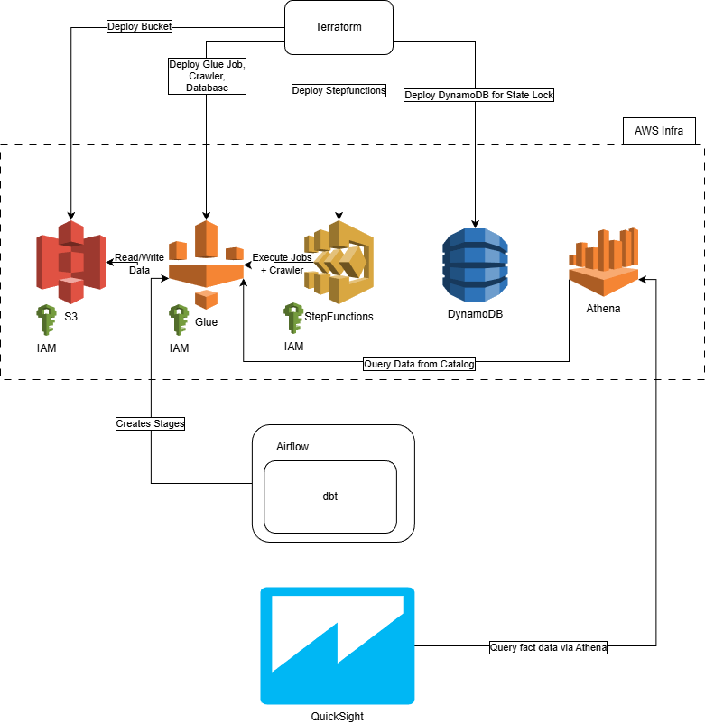
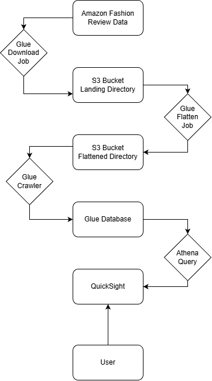
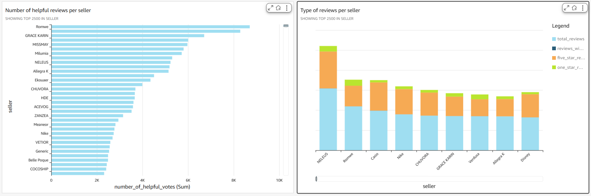
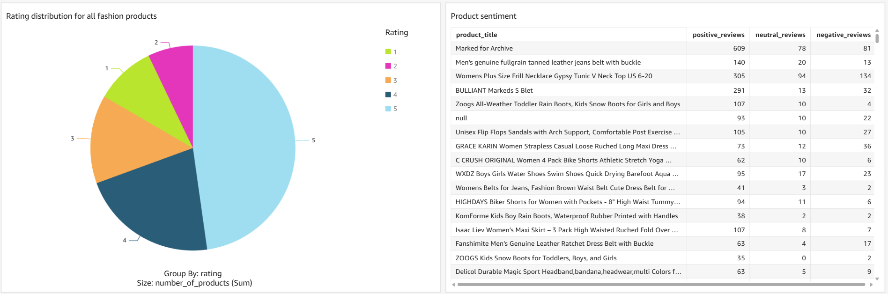

# 👗 AWS Vogue Vault

**Storing and Analyzing Amazon Fashion Treasures**

AWS Vogue Vault is an end-to-end **ETL pipeline** that ingests, transforms, and analyzes Amazon Fashion data using a fully serverless AWS architecture. The project is provisioned with **Terraform** and delivers analytics-ready datasets for **Athena** queries and **QuickSight** dashboards.

---

## 🏗️ Architecture

The solution is built using AWS-native services and Infrastructure as Code (IaC):

- **Terraform** – Infrastructure provisioning
- **Amazon S3** – Data lake (raw, processed, curated zones)
- **AWS Glue** – ETL jobs and Data Catalog
- **AWS Step Functions** – ETL workflow orchestration
- **Amazon Athena** – Serverless SQL analytics
- **Amazon QuickSight** – Business Intelligence & dashboards

---

## 🔄 ETL Pipeline Flow

1. **Extract** – Source fashion data lands in S3 (raw zone)
2. **Transform** – Glue jobs clean, enrich, and normalize data
3. **Load** – Curated datasets are stored and cataloged
4. **Analyze** – Athena enables fast, ad-hoc querying
5. **Visualize** – QuickSight delivers interactive BI insights

---

## 📊 Business Intelligence

QuickSight dashboards provide insights into fashion trends, pricing, categories, and product performance.

---

## ✨ Key Features

- Fully reproducible AWS infrastructure with Terraform
- Serverless and scalable ETL orchestration
- SQL-based analytics without data movement
- BI-ready datasets for rapid visualization
